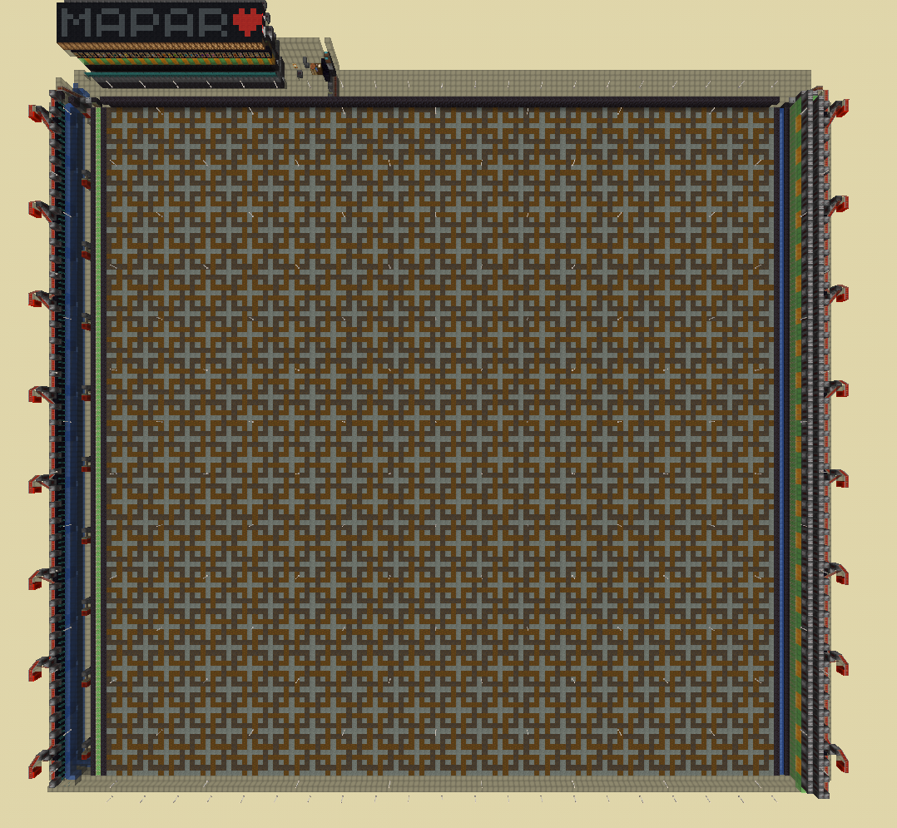
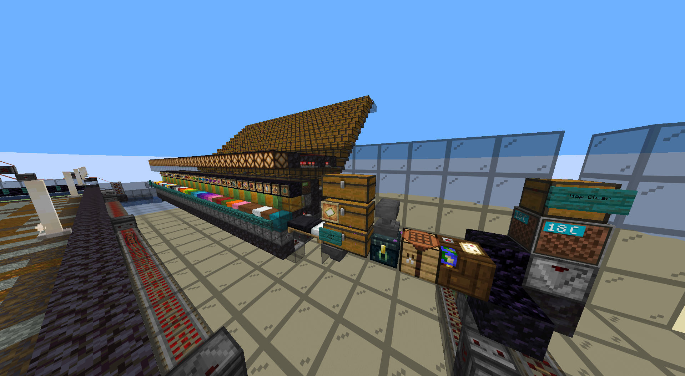

# Carpet Printer (Piston-Clearable and Fullblock as well)

The Carpet Printer allows you to build 2D carpet/piston clearable mapart from NBT files.
With a few settings changed (discussed down below), you can also make it work for Fullblock maps.
## Setup (Carpet only)
To get the program running we first need to build an area where we will build one 1x1 map at a time. It could look like this but could use any other mechanism to clear the carpets:

A Restock Station is required to refill the bot inventory. Ideally it is at the north side of the area. All essential components are labeled here:

Make sure it fulfills the following points:
- The fluid dispensers and lighting should cover the whole 128x128 MapArea.
- Avoid having grass blocks on the map area since it can lead to mobs spawning in certain biomes.
- The Restock Station should have a DumpStation, FinishedMapChest, MapMaterialChest, Reset Trapped Chest, and Cartography Table. The terms are explained below.
- Avoid having the bot pick up old carpets while restocking. The simplest way to avoid that is to place the carpet dupers a few blocks away from the Map Area and seperate them using slabs (also avoids "noob line").
- Make sure the server loads the entire map when resetting
- If Phantoms are on you need a glass ceiling.
- If you play on hard difficulty don't forget the regeneration 2 beacons

**A litematica file with an example Map Area can be found [here](CarpetPrinter.litematic).**

## Setup (Piston-Clearable)

First of all, why use Piston clearable?
Well, it's as easy to set up as a carpet platform, while having 36 colors (instead of the usual carpet 16). Furthermore, reusing the materials is not hard at all, but hopper speed might be a bottleneck if you use a lot of bots and/or your maps have a small amount of colors.

Here's the platform I use on 8b8t:

Like with the carpet only platform, it has all the essential components.

Make sure it fulfills the following points:
- The redstone here is very delicate, make sure everything is exactly as in the litematica down below.
- The 128x128 map area should be blocks you can place flowers on, so you can get those 2 extra colors (crimson fungi and pink petals)
- I recommend you build it over an ocean, however it can be built on any biome, but be careful with what passive mobs can spawn on it. If unsure, build the whole floor with pale moss or normal moss.
- The Restock Station should have a DumpStation, FinishedMapChest, MapMaterialChest, Reset Trapped Chest, and Cartography Table. The terms are explained below.
- Avoid having the bot pick up old blocks while restocking. Make them yeet the trash out of the platform or into fire.
- Make sure the server loads the entire map when resetting, you can make 10x10 chunks of Ender Pearl loaders. (But they are kinda broken on 8b8t at the moment)
- If Phantoms are on you need a glass ceiling.
- If you play on hard difficulty don't forget the regeneration 2 beacons. (Or other beacons if you are on 8b8t)

**Example platform (the one I use on 8b8t) can be found [here](PistonClearable.litematic).**

If you wish to recycle the materials
**you should take a look at this [other platform](PistonClearableRecycleAndSnow.litematic)**,
which has that plus a snow fill system.

Full credits for both of these platforms go to the original builders, crubleigh and evmodder.

**Make sure you watch [this video](https://www.youtube.com/watch?v=MVhEjSjanYU) to understand the platform better**

## Setup (Fullblock mode)

You can also use the Carpet Printer module to print Fullblock maps (crazy, huh?).
However, you should use the /home system if you wish to use it, otherwise you're better off using any of the other 2 modules.
Despite that, you could also come up with a platform design that can be used without homes or any changes to the code.

That being said, let me explain how you can make use of this module to print Fullblock maps:
- Enable teleport mode.
- Enable offset break checkpoints (otherwise they will always fall after breaking any error).
- Enable safewalk (to prevent some accidents).
- Enable Fall Fixer on the 8bUtils module (they will /home somewhere when they inevitably end up falling).

Here's the design I use on 8b8t:
[!Setup](FullBlock(CarpetMode).png)
Like the previous platforms, it has all the essential components.

Make sure it fulfills the following points:
- Make everything blast proof.
- The Restock Station should have a DumpStation, FinishedMapChest, MapMaterialChest, Reset Trapped Chest, and Cartography Table. The terms are explained below.
- Avoid having the bot pick up old blocks while restocking. Make them yeet the trash out of the platform or into fire.
- Make sure the server loads the entire map when resetting, you can make 10x10 chunks of Ender Pearl loaders. (But they are kinda broken on 8b8t at the moment)
- If Phantoms are on you need a glass ceiling.
- If you play on hard difficulty don't forget the regeneration 2 beacons. (Or other beacons if you are on 8b8t)

If you plan on making the same design as mine, here are some tips:
- Go from bottom to top, but build the tnt unloaders before doing the water or the glass
- You will find red glass on the litematic, that should be comparators before placing in the water
- Once they are filled for the first time, lock the hoppers with the redstone blocks so they don't break.
- If you ever need to refill the dispensers, place ice next to the red glass and replace the comparators, then readd the glass and break the ice without Silk Touch
- Tnt can be specially buggy on 8b8t, so always have that in mind.
- It is a very long and repetitive build, but very satisfactory to watch in action; it pays off.

**Example platform can be found [here](FullblockPlatform.litematic).**

### Special blocks
Let's go over all the special blocks we need at the restock station.

#### DumpStation
The bot will throw any excess in here. It doesn't matter if you destroy or sort the items as long as the bot won't pick them up again while restocking.

#### FinishedMapChest
Pretty self-explanatory. The bot will put the maps here.

#### MapMaterialChest
This chest should contain empty maps and glass panes for the bot to lock new maps.

#### Reset Trapped Chest
We use a trapped chest to activate the dispensers for a short amount of time. In contrast to a button, it is not destroyed by water, and we can easily confirm that the reset was activated.

### Load NBT files
When the module is started for the first time a "nerv-printer" folder is created in your Minecraft directory. Put in as many 2D 1x1 NBT files as you like. Keep in mind the bot will process them in alphabetical order.
## Workflow
The addon follows these 3 steps:

1. Register important blocks
2. Build Map
3. Create Map Item

### Register important blocks
The module will prompt you to interact with all necessary blocks. Chests only have to be selected once even though the rendered box might only highlight half of the chest. When you are done, interact with one of the start-blocks specified in the start-blocks setting (default are all buttons) to start printing. Every inventory slot containing nothing or carpets will be marked as a slot for future carpets.

### Build Map
The bot will build the map line by line. It calculates the maximum area he can cover with carpets using the free slots he has available and restocks accordingly. When one color is empty he dumps the remaining carpets into the DumpStation and the cycle repeats.

### Create Map Item
When the map is finished the bot grabs an empty map and glass pane from the MapMaterialChest and walks a small circle in the center to fill it. Depending on your render distance this step might be unnecessary. After storing the map the bot will trigger the reset and start with the next nbt file.

If you still need help: There is a YouTube video demonstrating the process (in spanish):

## Optional

### Save and Load Configurations
Register the blocks as usual, then press **Save Config** in the module settings when you are finished.  
To load a configuration, simply select the file and press the **Load** button. Printing is started in the usual way.

### Multi-User Printing
The printer can orchestrate multiple accounts simultaneously to print a map on the same map area.  
One bot acts as the **master** and instructs the other **slaves** via direct messages.

**Setup:**
1. Adjust the prefix and suffix in the settings. To circumvent DM signatures most servers use third-party DM plugins. As the syntax of them vary you will need to adjust pre- & suffix in the Multi-User-settings. Receiving DMs should look like this: (prefix)(sender's name)(suffix)(message)
2. Enable the module and load the configuration on **every** bot.
3. Move all slave bots into render distance of the master bot, then press the **Register** button using the master account. An **Accept** message should appear for each slave.
4. Start the print in the usual way.
